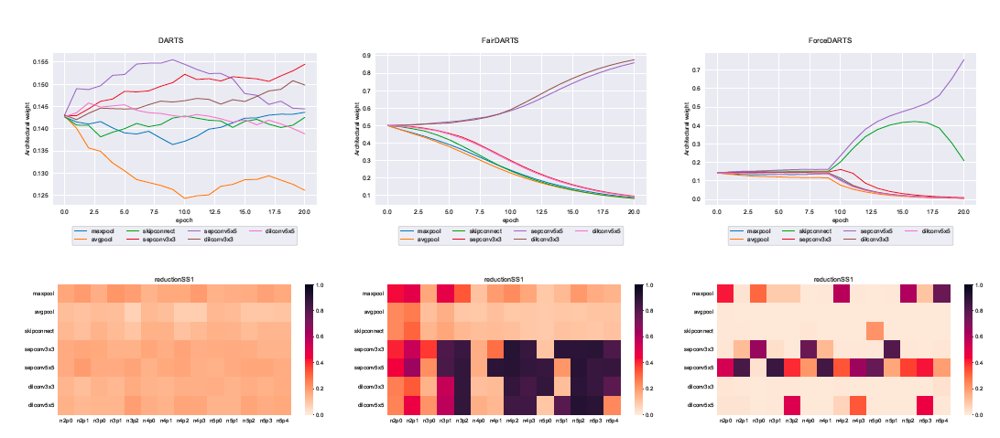
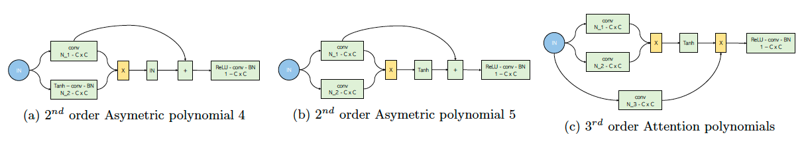

> This post is a simplified version of our paper on Neural Architecture Search in the complex field for audio recognition. You can read the full paper [here](/assets/pdf/papers/nas.pdf).
{: .prompt-info }

Designing a deep neural network can feel like navigating an endless sea of possibilities. With countless options for tweaking hyperparameters, shaping the network's structure, and deciding on the types of operations to use, the potential configurations are litterally limitless. While some incredibly powerful architectures have been handcrafted—like Transformers, CNNs, GNNs, or U-Net—there's still a vast uncharted territory of architectures waiting to be discovered.

This is where **Neural Architecture Search (NAS)** comes into play. NAS aims to automate the process of designing neural network architectures, optimizing not just the weights but the structure itself. Though this can be computationally heavy, NAS has delivered impressive results, especially in fields like image recognition. But let's clear something up right away: NAS isn't magic. You still need to define the search space—the range of architectures you want to explore. So, you're not literally testing *every* possible configuration.

## Two Main Approaches for NAS

NAS methods generally fall into two categories: those that evaluate each architecture individually and **one-shot** methods that assess multiple architectures simultaneously. One of the most promising one-shot methods is [DARTS](), which uses gradient descent to optimize architectures. Since its introduction, many DARTS variants have been developed, each addressing specific limitations and showing potential for audio applications.

In our work, we focus on DARTS and its variant, [FairDARTS](), to find the best neural architectures for supervised audio recognition tasks. We also introduce **ForceDARTS**, a new variant inspired by FairDARTS. In addition, we pushed the boundaries of traditional search spaces by incorporating polynomial and complex operations. Finally, while many audio preprocessing methods convert the output of the Short-Time Fourier Transform (STFT) into real numbers, we also explored the benefits of keeping the imaginary components and using complex operations.

## Breaking Down DARTS: The Basics

DARTS represents a neural network as a collection of nodes (think of them as points where data is processed) and edges (the operations that connect these points) arranged in a directed acyclic graph (DAG). Each node connects to all previous nodes, and the output of each node is a sum of the operations applied by the connecting edges.

Formally, each node $$j$$ is connected to all preceding nodes $$i$$ (where $$i < j$$), and the output of node $$j$$ is calculated as:

\begin{equation}
    x_j = \sum_{i < j} e_{i,j}(x_i) 
\end{equation}

Here, $$e_{i,j}(x_i)$$ represents the output of the edge connecting node $$i$$ to node $$j$$. For each edge, there is a set of $$M$$ candidate operations, $$O = \{o^1, o^2, ..., o^M\}$$, which defines the search space. All edges share the same set of operations. The challenge is to determine the best operation for each edge. Ideally, you'd have a one-hot vector $$\beta_{i,j}^{o} \in \{0,1\}$$ that selects one operation among the $$M$$ possible ones. 

In DARTS, this problem is relaxed by introducing a coefficient $$\alpha_{i,j}^o \in \mathbb{R}$$ associated with each operation $$o \in O$$. The vector $$\alpha_{i,j}$$ contains all the $$\alpha_{i,j}^o$$ values, and the one-hot vector $$\beta_{i,j}$$ is approximated by applying the softmax function to $$\alpha_{i,j}$$. Given an input $$x$$, the output of an edge $$e_{i,j}$$ is computed as:

\begin{equation}
    e_{i,j}(x) = \sum_{o \in O} \frac{\exp(\alpha_{i,j}^o)}{\sum_{o' \in O} \exp(\alpha_{i,j}^{o'})} o(x) \approx \sum_{o \in O} \beta_{i,j}^{o} o(x)
\end{equation}

The architecture is fully defined by the concatenation of all the $$\alpha_{i,j}$$ vectors for $$i < j$$. Let’s denote this vector by $$\alpha$$. Finding the best architecture comes down to finding the optimal $$\alpha$$, denoted as $$\alpha^*$$. The goal is to minimize the validation loss over $$\alpha$$ while simultaneously finding the best weights $$w^*(\alpha)$$ for this architecture during training. This is a bi-level optimization problem.

Once the best architecture $$\alpha^*$$ is found, the operation with the highest coefficient is selected for each edge:

\begin{equation}
o_{i,j} = \arg\max_{o \in O} \alpha_{i,j}^o
\end{equation}

This step is known as the **pruning operation**.

### Visualizing DARTS

Here is a video that provides good visual explanation of the core concepts DARTS with nice visualizations.



## ForceDARTS: reducing the impact of pruning

DARTS has its drawbacks, particularly during the pruning process. The gap between the one-shot model and the pruned model can be significant, which can negatively impact performance. ForceDARTS aims to reduce this gap by gently pushing the algorithm to select architectures that are closer to a one-hot structure for architectural weights and multi-hot for edge weights.

While [FairDARTS]() addresses this by pushing the architectural weights towards 0 or 1, it doesn't explicitly force them into a one-hot structure. ForceDARTS takes this a step further by reintroducing the original softmax function and adding a loss that encourages the architecture to lean towards a pure distribution—a one-hot vector. This loss is inspired by purity measures used in decision trees, like **Gini impurity** and **Entropy**.

Given a distribution $$p = \{p_1,p_2, ..., p_C\}$$, these purity measures are defined as:

\begin{equation}
    Gini(p) = \sum_{i = 1}^C p_i(1 - p_i) \quad E(p) = - \sum_{i = 1}^C p_i \log(p_i) \quad \text{s.t.} \quad \sum_{i = 1}^C p_i = 1
    \label{eq:purity_function}
\end{equation}

Both reach their minimum value (0) for a pure distribution and their maximum value ($$(C-1)/C$$ for Gini impurity and $$\log(C)$$ for Entropy) for an impure distribution. The differences in architectural weights obtained with DARTS, FairDARTS, and ForceDARTS are shown in the figure below:

*Figure 1: Final architectural weights $$\alpha$$ obtained with DARTS (left), FairDARTS (middle), and ForceDARTS (right)*

## Diversifying the Search Space

Beyond the method itself, existing NAS methods can be improved by optimizing the search space. Most studies using DARTS stick to the original search space defined in the DARTS paper. In our work, we diversified the search space by introducing polynomial operations. Our goal was to see how these new operations could improve the final results. Below is a figure showing some of the polynomial operations we introduced:

*Figure 2: Polynomial operations introduced into the search space, for more information check the paper*

## What We Found

We tested our methods on an audio dataset using both real and complex neural networks. The details are in the [paper](/assets/pdf/papers/nas.pdf), but here’s the gist:

Our main goal was to explore new and existing methods in NAS for audio recognition in the complex field. We proposed ForceDARTS, a DARTS variant that showed better performance than DARTS and was on par with FairDARTS. Additionally, we diversified the search space by introducing pairwise operations. This diversification yielded results similar to those with the original search space, though it also increased the risk of ending up with an unstable architecture, especially when polynomial operations were heavily used.

