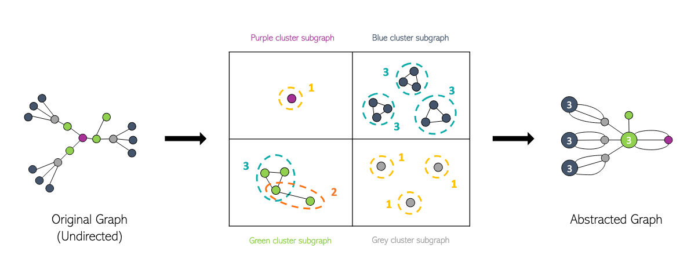
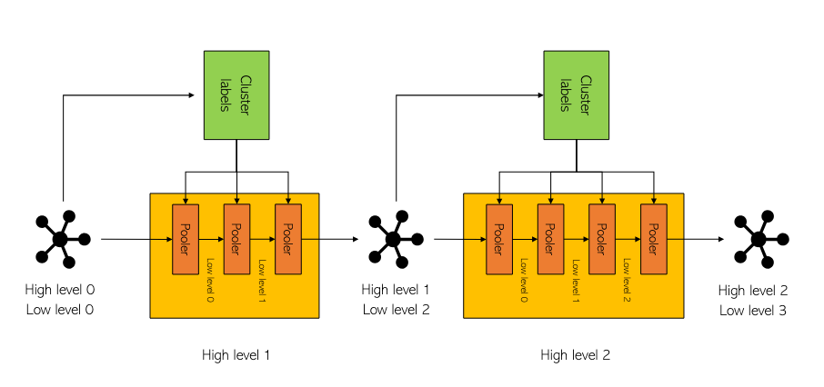

> This post is a condensed version of our paper on knowledge graph abstraction. You can check out the full paper [here](/assets/pdf/papers/knowledge_graph.pdf).
{: .prompt-info }

### Simplifying Knowledge Graphs: A Step-by-Step Approach to Abstraction

Knowledge Graphs (KGs) are becoming the go-to solution for storing and organizing complex, real-world data. By representing relationships and features as labeled edges and nodes, KGs offer a detailed way to model everything from social networks to communication systems and even biological entities. However, as these networks grow, they can quickly become overwhelming. Imagine trying to make sense of a graph with tens of millions of nodes — well, good luck ! Even with advanced visualization tools, extracting meaningful insights from such massive graphs becomes nearly impossible. That’s where the need for efficient summarization techniques comes in.

In our latest work, we’ve tackled this challenge head-on by developing a method to create progressively smaller versions of these massive Knowledge Graphs, which we call "abstracted graphs"." The basic idea is to merge nodes and subgraphs that share similar local structures, effectively reducing the graph’s size without losing important information. To achieve this, we’ve combined deep graph neural networks with advanced graph processing techniques, all fine-tuned for this specific task. The goal? To make these sprawling networks more manageable while still preserving their valuable insights.

## The Three-Step Method: Cluster, Merge, Repeat

Our approach to reducing the size of Knowledge Graphs can be boiled down to three simple steps:
1. [Cluster](#cluster) the nodes based on their local neighborhood.
2. [Merge](#merge) nodes based on both their cluster labels and their position in the graph.
3. [Repeat](#repeat) these operations until the graph reaches the target size.

Let’s dive into each of these steps in more detail.

### Step 1: Clustering Nodes with a Variational Graph Auto-Encoder

First up, we need to cluster the nodes. The idea here is that we want to merge nodes with similar neighborhoods (i.e., nodes that are connected in similar ways) together, so we want to cluster them based on their neighborhood. To do this, we use a Variational Graph Auto-Encoder (VGAE) with a Relational Graph Convolutional Network for the encoder and with a twist for the latent distribution—we impose a multimodal distribution on the latent space, which ensures that the nodes are clustered effectively. For the multimodal distribution, we rely on the Gaussian Mixture Model (GMM), a well-established method. 

Check out the comparison below: on the left, you can see the latent space of a traditional Graph Auto-Encoder, and on the right, we have our VGAE combined with GMM.

{: width="972" height="589" }
*Figure 1: Latent spaces*

Notice how our method results is closer to a multimodal distribution.

### Step 2: Merging Nodes

Once we’ve clustered the nodes using VGAE, the next step is to merge them. Nodes are merged based on both their cluster labels and their positions in the knowledge graph. Specifically, we want to avoid merging nodes that are too far apart in the graph.

To fulfill this, here’s the rule we follow:

<b>Two nodes can be merged only if they belong to the same cluster and their shortest path length is less than 2.</b>

In the figure below, you can see an example of this merging process. On the left is the original Knowledge Graph with node colors representing the labels computed by the VGAE. In the middle, you can see the potential merges according to our rule, and on the right is the final output with merged nodes.

{: width="972" height="589" }
*Figure 2: Example of merging operation*

But we don’t stop after one round of merging. We keep the same labels and continue merging nodes according to our rule until no further merges are possible. This iterative process is shown in the figure below:

{: width="972" height="589" }
*Figure 3: Repeating the merging operation*

The result of this process is what we call a "High-level 1 abstracted graph". In the next section, we’ll explain why we refer to it this way.

### Step 3: Repeating the Process for Deeper Abstraction

At this stage, we’ve successfully generated our first abstracted graph using the combination of VGAE and our merging process, which we call the "superpooler." The size reduction of the graph depends on several factors, including the number of clusters, choice of hyperparameters, and the structure of the original graph. Ideally, our method should allow us to generate abstracted graphs as small as needed, but with the current setup, there are some limitations.

To overcome this, we can simply reapply the same operations to the first abstracted graph. This refinement process, which is illustrated in the figure below, allows us to create even smaller, more abstracted versions of the original graph.

{: width="972" height="589" }
*Figure 4: Multi-level abstraction module*

## See It in Action

Curious to see how this all looks in practice? Check out the video below, which shows the abstraction process of a graph through three levels of abstraction.

